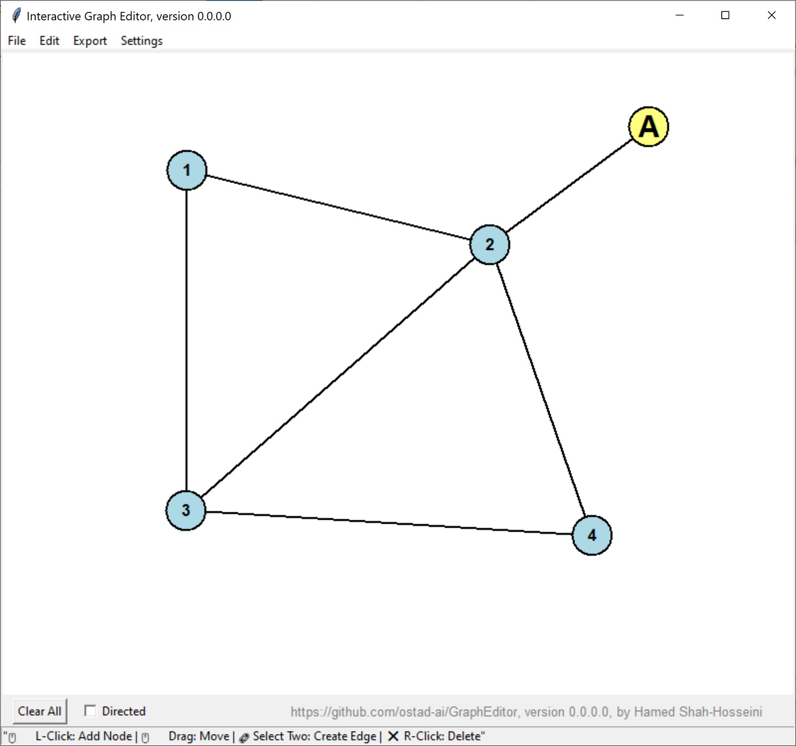

# Graph Editor
This application creates a graph interactively with these properties:
1. You can save the graph as a JSON file, a Python file holding a dictionary for an adjacency list, or a text file as an adjacency list. 
2. It also supports exporting to an SVG file.
3. You can change the labels, colors, font colors and styles, edge colors and styles, node colors and styles in **Settings**.
4. You have the utility **Undo/Redo** (CTRL+Z/CTRL+Y).
5. You can add nodes by left-mouse click.
6. You can create an edge by two left-clicks on two nodes.
7. You can remove nodes or edges by right-mouse click.
8. You can have **directed** edges by checking the option in the bottom of window.
9. You can **drag** nodes by left-mouse button.

## This archive includes the executable program: **grapheditor.exe**, which is suitable for **Windows 10** and over. You should click on the executable to run.
[Download the archive for win64](https://drive.google.com/file/d/16rV7b6lnYWbuCNfPWp6rKIlJrp1duEwT/view?usp=sharing)
---
 *Figure 1: A snapshot of GraphEditor, version 0.0.0.0, while creating a graph.*
---
